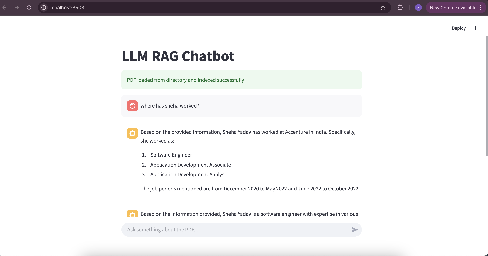
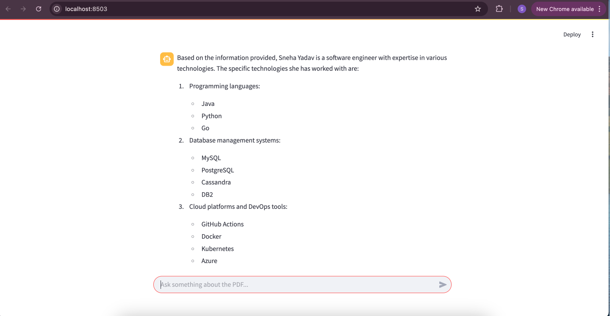

# RAG Chatbot with ChromaDB & Ollama LLM

## 📌 Overview
This project is a **Retrieval-Augmented Generation (RAG) chatbot** that allows users to query a **PDF document** using a locally running **Ollama LLM**. It utilizes **ChromaDB** for vector storage and retrieval, enabling efficient document search.

## 🏗 Project Structure
```
LLM-chatbot/
│── chat.py             # Streamlit UI and chatbot logic
│── data_handler.py     # Handles PDF ingestion and ChromaDB operations
│── query_llm.py        # Queries the local Ollama LLM with retrieved text
│── .venv/              # Virtual environment (optional)
│── requirements.txt    # Python dependencies
│── README.md           # Project documentation
```

## ⚙️ Features
- **Extracts text from PDFs** and stores vector embeddings in **ChromaDB**.
- **Retrieves relevant text** chunks based on user queries.
- **Uses Ollama LLM** for intelligent responses.
- **Streamlit UI** for easy interaction.

## 🚀 Installation & Setup
### 1️⃣ Clone the Repository
```bash
git clone https://github.com/sn3hay/LLM-chatbot.git
cd LLM-chatbot
```

### 2️⃣ Create & Activate Virtual Environment
```bash
python3 -m venv .venv
source .venv/bin/activate  # macOS/Linux
.venv\Scripts\activate    # Windows
```

### 3️⃣ Install Dependencies
```bash
pip install -r requirements.txt
```

### 4️⃣ Run the Chatbot
```bash
streamlit run chat.py
```

## 🏗 How It Works
1. **PDF Processing**: Extracts text from uploaded PDFs.
2. **Vector Storage**: Converts text into embeddings & stores them in **ChromaDB**.
3. **Query Handling**: Uses **similarity search** to retrieve relevant text.
4. **LLM Response**: Sends retrieved text to **Ollama LLM** for answering user queries.

## 🖼 Screenshots of Outcome
Here are some screenshots of the chatbot in action:


*Response given by the chatbot.*


*Response given by the chatbot.*

## 🛠 Configuration
- Ensure **Ollama LLM** is running locally.
- Adjust ChromaDB parameters as needed in `data_handler.py`.

